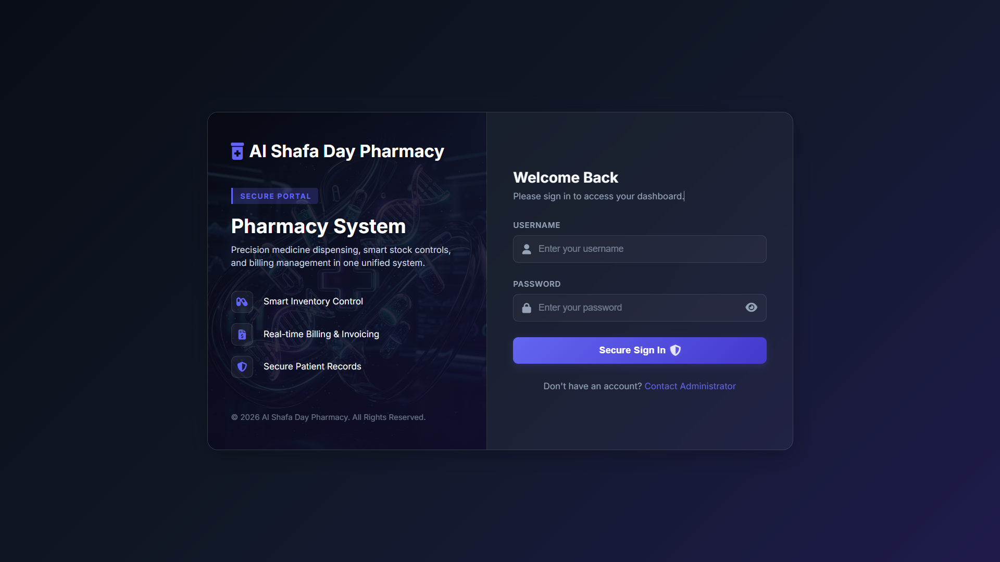
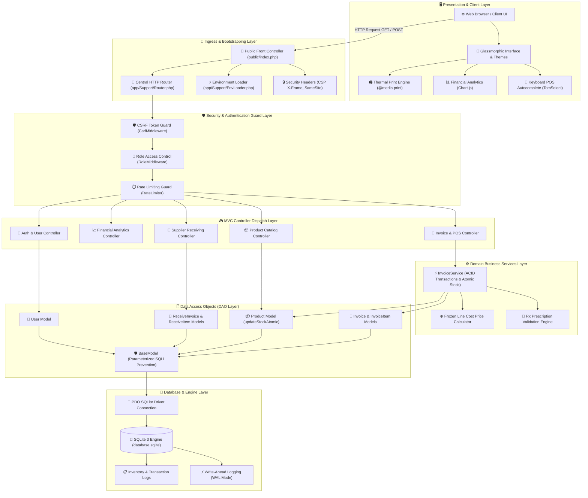
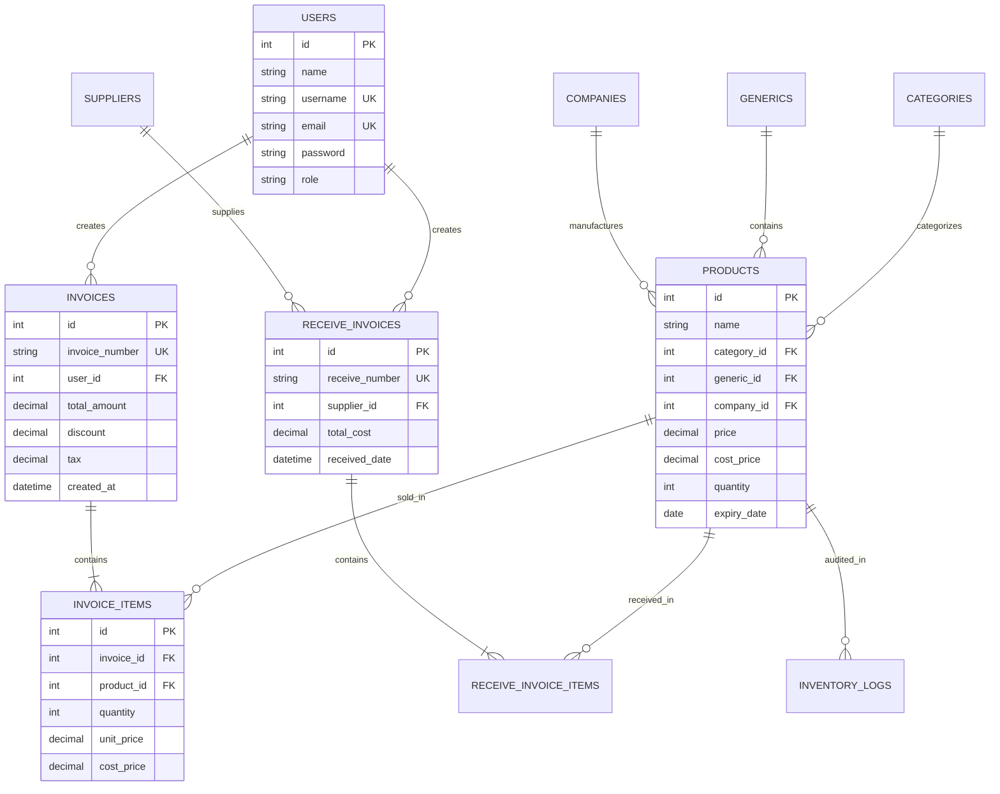
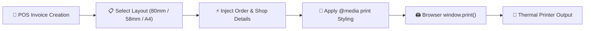

# 🏥 Pharmacy Management System (PMS)

<div align="center">


**A modern, robust, high-performance web application for retail pharmacies, medical stores, and hospital dispensaries.**

[Screenshots](#-application-screenshots) • [Demo Credentials](#-demo-login-credentials) • [Features](#-key-features) • [Architecture](#-system-architecture) • [Quick Start](#-quick-start--installation)

</div>

---

## 🌟 Overview

**Pharmacy Management System (PMS)** is an enterprise-ready Point-of-Sale (POS) and inventory control system engineered specifically for retail and clinical pharmacy workflows. Built on a lightweight, modular **PHP MVC Architecture** backed by an optimized **SQLite Database operating in Write-Ahead Logging (WAL) mode**, PMS delivers high-throughput POS checkouts, real-time stock notifications, FEFO (First-Expired, First-Out) tracking, and customizable thermal receipt printing.

---

## 🔑 Demo Login Credentials

For quick evaluation and testing, you can use the pre-configured default demo accounts:

| Role | Username / Email | Password | Granted Access |
| :--- | :--- | :--- | :--- |
| **Administrator / Owner** | `admin` *(or `admin@example.com`)* | `admin@123` | Full administrative control, catalog management, supplier intake, financial analytics, system settings, user management, database backups. |
| **Salesman / Cashier** | `salesman` *(or `salesman@pms.com`)* | `salesman@123` | POS sales invoice creation, return invoice processing, real-time product stock lookups, personal profile settings. |

> [!TIP]
> In production environments, ensure you change default passwords from the **User Settings** menu.

---

## 🖼️ Application Screenshots

<div align="center">

### 🛒 Point of Sale (POS) Billing Interface
*Fast, keyboard-driven checkout with barcode scanner integration, Rx prescription checks, and real-time total calculations.*


<br>

| 📊 Manager Analytics Dashboard | 👤 Salesman Dashboard |
| :---: | :---: |
|  |  |
| *Real-time sales KPIs, profit margins & asset valuation* | *Streamlined POS stats, daily checkouts & inventory lookup* |

<br>

| 📦 Inventory & Medicine Catalog | 🚚 Receive Stock Delivery |
| :---: | :---: |
|  |  |
| *Stock management, generic mapping & expiry alerts* | *Supplier purchase intake & auto stock incrementing* |

<br>

| 📈 Financial Reports & Analytics | ⚙️ System Settings & Preferences |
| :---: | :---: |
|  |  |
| *Exportable sales, profit & inventory reports* | *Pharmacy metadata, tax rates & receipt configuration* |

<br>

| 🔑 Secure Authentication & Login |
| :---: |
|  |
| *Role-based security authentication for Cashiers & Admins* |

</div>

---

## ✨ Key Features

### 🛒 Point of Sale (POS) & Billing
- **Atomic Stock Checkout:** Prevents negative inventory under simultaneous cashier transactions using atomic SQL decrements (`WHERE quantity >= :qty`).
- **Rx Prescription Validation:** Enforces mandatory Doctor Name and License verification whenever prescription-restricted medicines are added to an order.
- **Frozen Historical Accounting:** Freezes cost prices (`cost_price`) into individual sales line-items at checkout, keeping historical profit reporting accurate even when supplier restock costs change.
- **Return & Refund Processing:** Automated return invoice generation (`is_return = 1`) with stock restoration and audit logging.

### 📦 Inventory & Catalog Control
- **Generic Composition Search:** Allows cashiers to instantly locate alternative medicines sharing identical active chemical ingredients (`/api/products/search_generic`).
- **Smart Stock & Expiry Alerts:** Real-time warnings for low-stock thresholds (`quantity <= min_stock_level`) and near-expiry/expired items.
- **Supplier Intake Management:** Dedicated workflow for purchase orders (`ReceiveInvoice`), automating stock intake and auto-incrementing reference numbers (`RI-XXXXX`).

### 🖨️ Thermal Receipt Printing Engine
- **Multi-Format Print Templates:** Built-in templates for 80mm roll, 58mm compact roll, and standard A4/Letter invoice layouts using CSS `@media print`.
- **Thermal Monospace Formatting:** Clean layout with clear store branding, tax details, discount breakdown, and QR/barcode identifiers.

### 📊 Analytics & Reporting
- **Interactive Dashboards:** Real-time financial KPI metrics including total revenue, gross profit, sales counts, customer metrics, and profit margins.
- **Multi-Format Exports:** Export analytics and inventory reports in PDF, Excel, and Word formats.

### 🎨 Modern Glassmorphism UI
- **Dynamic Themes:** Toggle between **Glassmorphism** (translucent light glass), **Neon Dark** (vibrant violet dark mode), and **Flat Classic** (high-contrast clinical white).
- **Keyboard-Optimized Checkout:** Fast autocomplete dropdowns powered by TomSelect for rapid barcode/name scanning.

---

## 🏗 System Architecture

PMS utilizes a 7-tier modular architecture emphasizing request security, transactional integrity, and high-concurrency database throughput.



---

## 🗃 Database Entity Relationship Diagram

The underlying database uses an optimized SQLite schema with strict foreign key constraints and transactional integrity.



---

## 🖨 Thermal Receipt Engine

The thermal printing system generates clean receipts directly within browser windows without external software drivers.



---

## 💻 Tech Stack & Tools

| Component | Technology | Description |
| :--- | :--- | :--- |
| **Backend Core** | PHP 8.x | Lightweight MVC architectural framework |
| **Database** | SQLite 3 (WAL Mode) | Non-blocking concurrent data store |
| **Frontend** | HTML5, CSS3, JavaScript (ES6) | Responsive Glassmorphism interface |
| **Components** | TomSelect, Chart.js, Bootstrap Icons | Dynamic dropdowns, UI charts, icon sets |
| **Security** | CSRF Middleware, PDO Sanitation, Bcrypt | Anti-XSS/SQLi & password security |
| **Report Exports** | HTML-to-PDF / Office Templates | Exportable financial & inventory reports |

---

## 📁 Repository Structure

```files
PMS/
├── app/
│   ├── Controllers/       # HTTP Request Handlers (POS, Products, Invoices, Reports)
│   ├── Middleware/        # Security Guards (CSRF, Authentication, RBAC)
│   ├── Models/            # Database Access Objects (BaseModel, Product, Invoice)
│   ├── Services/          # Business Logic (InvoiceService, Transaction processing)
│   └── Support/           # Routing & Environment Loaders (Router, EnvLoader)
├── config/                # Database & PDO Configuration (db.php)
├── database/              # SQLite Database file & Migrations
├── docs/                  # Application Documentation & Screenshots
│   └── images/            # UI Showcase Screenshots
├── public/                # Public Document Root
│   ├── assets/            # CSS Themes, JS Scripts, Icons, Images
│   ├── uploads/           # Product & Profile Images
│   └── index.php          # Front Controller Entry Point
├── resources/             # Views & Templates
│   └── views/
│       ├── templates/     # Thermal Print Layouts (80mm, 58mm, A4)
│       └── ...            # Application Views
├── routes/                # Route Definitions (web.php, api.php)
├── .env.example           # Environment Configuration Template
├── .gitignore             # Git Exclusions File
└── composer.json          # Dependency Manifest
```

---

## 🚀 Quick Start & Installation

### Prerequisites
- **PHP 8.0+** with `pdo_sqlite`, `mbstring`, and `openssl` extensions enabled.
- **Web Server:** Apache (via XAMPP / WampServer) or built-in PHP CLI server.

### Step 1: Clone the Repository
```bash
git clone https://github.com/YOUR-USERNAME/PMS.git
cd PMS
```

### Step 2: Set Up Environment Configuration
Copy the `.env.example` file to `.env`:
```bash
cp .env.example .env
```
*(Optionally adjust database path or application environment settings in `.env`).*

### Step 3: Run the Application

#### Option A: Using PHP Built-in Web Server (Easiest)
```bash
php -S localhost:8000 -t public
```
Open your browser and navigate to `http://localhost:8000`.

#### Option B: Running under XAMPP / Apache
1. Place the `PMS` directory inside your `xampp/htdocs/` folder.
2. Ensure Apache is running in the XAMPP Control Panel.
3. Open your browser and navigate to `http://localhost/PMS/public`.

---

## 🔒 Security & Data Integrity

- **SQL Injection Prevention:** All database queries utilize parameterized PDO bindings enforced through `BaseModel`.
- **CSRF Protection:** State-modifying requests (`POST`/`PUT`/`DELETE`) validate CSRF tokens via `CsrfMiddleware`.
- **Password Hashing:** Passwords are standardly hashed using `password_hash()` with `PASSWORD_DEFAULT` (Bcrypt).
- **Session Hardening:** Cookies enforce `HttpOnly` and `SameSite=Strict` policies.

---

<div align="center">

Made with ❤️ for modern pharmacies and healthcare providers.

</div>
